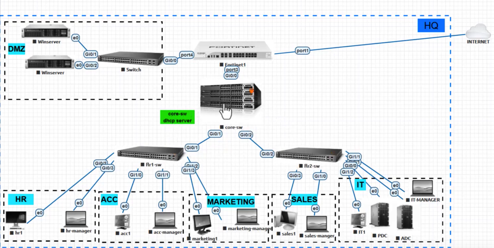

# Small Network Setup – FortiGate & Cisco

Dieses Projekt dokumentiert ein kleines Unternehmensnetzwerk mit einer FortiGate-Firewall und Cisco-Switches/Router. Ziel ist es, Netzwerkfunktionen wie VLANs, Routing, NAT und Internetzugang über eine zentrale Firewall zu demonstrieren.

